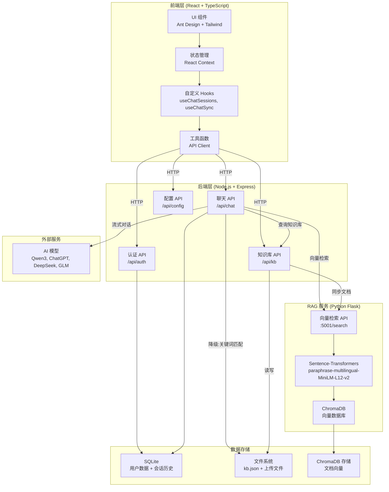
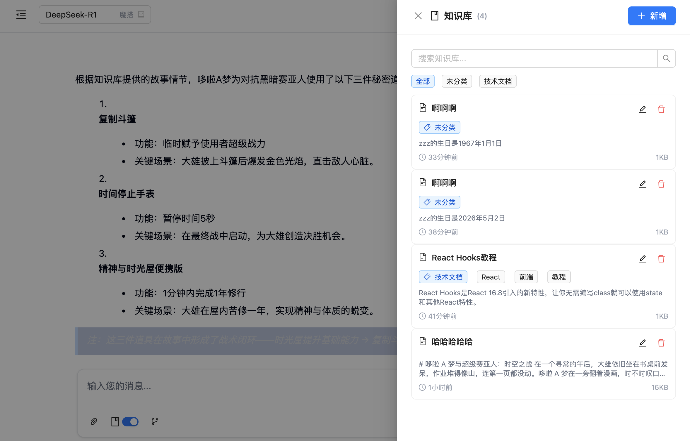
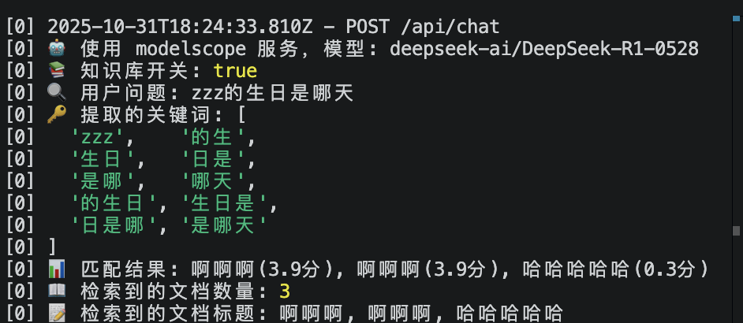
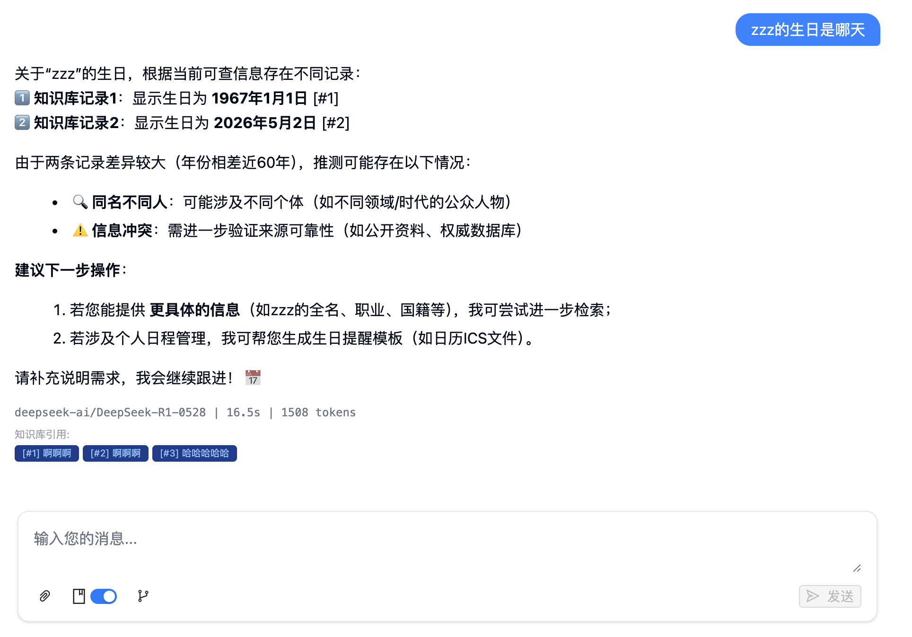

# Chat Studio

<div align="center">
  <p>
    <a href="#中文">🇨🇳 中文</a> | 
    <a href="README.en.md">🇺🇸 English</a>
  </p>
  
  <!-- Star 呼吁与建议征集 -->
  <p>
    <strong> 如果这个项目对你有帮助，请给个 Star🌟 支持一下！</strong><br>
    <strong>欢迎提出宝贵建议和功能需求，让我们一起完善这个项目！</strong>
  </p>
</div>

<div align="center">
  
</div>

**Chat Studio：** 一个开源的 AI 对话平台，支持多会话并发、知识库增强与数据分析。前端基于 React + TypeScript 构建，后端采用 Node.js。

## 系统架构



### 架构说明

**前端层**：React 单页应用，使用 Context API 管理全局状态，通过自定义 Hooks 实现会话管理、云端同步等功能。

**后端层**：Express RESTful API，处理聊天、认证、知识库管理等业务逻辑，支持流式响应和文件上传。

**RAG 服务**：独立的 Python Flask 服务，提供基于 Transformer 的语义向量检索，使用 ChromaDB 存储文档向量。当向量服务不可用时，自动降级到关键词匹配模式。

**数据存储**：SQLite 存储用户数据和会话历史，文件系统存储知识库文档，ChromaDB 存储文档的向量表示。

**外部服务**：集成多个 AI 大模型提供商，支持实时切换和流式输出。

## 技术栈

- **前端**: React 19 + TypeScript + Vite
- **UI**: Ant Design + Tailwind CSS
- **工程化**: Vite + ESLint + PostCSS + pnpm
- **RAG**:
  - **向量检索**: Sentence-Transformers (paraphrase-multilingual-MiniLM-L12-v2) + ChromaDB
  - **降级方案**: 关键词匹配 + N-gram 中文分词
  - **后端**: Python Flask API (端口 5001)
  - **文件处理**: multer（文件上传）+ fs（文档存储）
- **Markdown**: react-markdown + remark-gfm + rehype-highlight
- **代码高亮**: highlight.js

## 功能特性

- **AI 智能对话聊天**

  - **AI 集成** ：支持 Qwen3、ChatGPT、DeepSeek、GLM 等多个 AI 模型，支持模型实时切换
  - **持久化会话** ：对话历史本地存储，刷新后数据不丢失
  - **多会话并发** ：支持多个对话同时发送消息，各会话具备独立的输入状态、上下文和 UI，互不干扰
  - **智能标题** ：根据用户首条消息自动生成会话标题，提高可读性
  - **实时交互** ：加载状态反馈，智能滚动控制，流式回复底部吸附
  - **停止生成** ：支持中断 AI 消息生成，提供更好的用户控制体验
  - **Markdown 渲染** ：完整支持 Markdown 语法、代码高亮、表格、列表等格式化显示
  - **流式输出** ：实时显示 AI 回复内容，支持流式语法修复和智能渲染
  - **统计信息** ：显示 AI 回复的模型信息、响应时间、Token 消耗统计
  - **错误处理** ：网络异常、API 错误的友好提示和处理机制
  - **响应式设计** ：适配桌面端和移动端，侧边栏折叠功能，在小窗口也有良好的用户体验
  - **高级设置** ：支持 Temperature、Top-P 参数调节，自定义系统提示词

- **知识库增强**

  - **文档管理** ：支持新增、编辑、删除知识库文档
  - **文本与文件** ：支持直接文本输入或上传文件（.txt, .md, .pdf, .doc, .docx）
  - **分类与标签** ：文档支持分类和多标签管理，便于组织和检索
  - **智能检索** ：中文分词优化的关键词匹配算法，支持多关键词搜索
  - **RAG 集成** ：检索增强生成（RAG），AI 回复基于知识库内容生成
  - **来源引用** ：AI 回答时自动标注知识库来源，使用 [#1]、[#2] 格式引用
  - **侧边抽屉** ：知识库管理界面以抽屉形式从右侧滑出，不影响主聊天界面
  - **卡片展示** ：文档以卡片形式展示，包含标题、分类、标签、更新时间、内容预览

  <div align="center">
    
    
    
  </div>

- **数据分析**（开发中）

## 快速开始

**📖 详细启动指南**: [STARTUP.md](./STARTUP.md)

**环境要求**：

- Node.js ≥18
- pnpm ≥8
- Python ≥3.12（用于向量检索服务）

### 1. 安装依赖

```bash
# 克隆项目
git clone https://github.com/your-username/chat-studio.git
cd chat-studio

# 安装前后端依赖
pnpm install:all

# 安装 Python 向量检索服务依赖
cd rag
uv venv
source .venv/bin/activate  # Windows: .venv\Scripts\activate
uv pip install -e .
cd ..
```

### 2. 启动服务

#### 方法 1: 完整启动（推荐）

```bash
# 终端 1: 启动向量检索服务
cd rag
chmod +x start.sh
./start.sh

# 终端 2: 启动前后端
pnpm dev
```

#### 方法 2: 仅前后端（降级模式）

如果不启动向量服务，系统会自动降级到关键词匹配模式：

```bash
# 启动开发服务器（前后端同时启动）
pnpm dev

# 或分别启动
pnpm client:dev  # 前端 http://localhost:5173
pnpm server:dev  # 后端 http://localhost:3001
```

### 3. 访问应用

- **前端**: http://localhost:5173
- **后端 API**: http://localhost:3001
- **向量检索服务**: http://localhost:5001

### 4. 构建生产版本

```bash
pnpm build
```

## 项目结构

```
chat-studio/
├── client/                  # 前端代码（React + TypeScript）
│   ├── public/             # 静态资源
│   │   └── images/        # 图片资源
│   ├── src/
│   │   ├── components/    # 组件库
│   │   │   ├── layout/   # 布局组件（Header, Sidebar, MainLayout）
│   │   │   ├── ui/       # UI组件（ChatInput, Markdown渲染器等）
│   │   │   └── auth/     # 认证相关组件
│   │   ├── contexts/      # React Context（ChatContext, AuthContext）
│   │   ├── hooks/         # 自定义 Hooks（useChatSessions, useChatSync）
│   │   ├── pages/         # 页面组件（Home, Login, Register）
│   │   ├── types/         # TypeScript 类型定义
│   │   ├── utils/         # 工具函数（API客户端、知识库API）
│   │   ├── App.tsx        # 应用主组件
│   │   └── main.tsx       # 应用入口
│   ├── .env.development   # 开发环境配置
│   ├── .env.production    # 生产环境配置
│   ├── vite.config.ts     # Vite 配置
│   ├── tailwind.config.js # Tailwind CSS 配置
│   └── package.json       # 前端依赖配置
├── server/                 # 后端代码（Node.js + Express）
│   ├── routes/            # API 路由
│   │   ├── chat.js       # AI聊天API（支持流式输出、知识库检索）
│   │   ├── auth.js       # 用户认证API
│   │   ├── kb.js         # 知识库管理API（文档增删改查、文件上传）
│   │   └── config.js     # 配置API（模型列表等）
│   ├── db/                # 数据库相关
│   │   └── database.js   # SQLite 数据库操作
│   ├── data/              # 数据存储
│   │   ├── kb.json       # 知识库文档存储
│   │   └── uploads/      # 上传文件存储目录
│   ├── utils/             # 工具函数
│   │   └── keyManager.js # API密钥管理
│   ├── .env               # 环境变量配置（API密钥等）
│   ├── server.js          # 服务器入口文件
│   └── package.json       # 后端依赖配置
├── rag/                    # RAG 向量检索服务（Python）
│   ├── vector_store.py    # 向量库核心逻辑（Sentence-Transformers + ChromaDB）
│   ├── api_server.py      # Flask REST API 服务
│   ├── start.sh           # 服务启动脚本
│   ├── chroma_db/         # ChromaDB 向量数据存储目录
│   ├── pyproject.toml     # Python 依赖配置
│   ├── README.md          # RAG 服务详细文档
│   └── main.ipynb         # RAG 实验 Jupyter Notebook
├── package.json            # 根目录配置（统一管理前后端）
├── pnpm-workspace.yaml     # pnpm工作空间配置
└── README.md               # 项目说明文档
```
